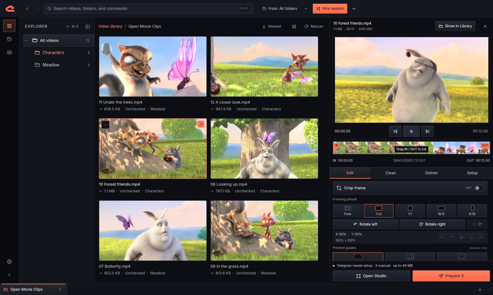

# ClipRelay

[](https://github.com/reduced2ash/cliprelay/actions/workflows/ci.yml)
[](https://github.com/reduced2ash/cliprelay/releases)
[](LICENSE)

ClipRelay is a local-first desktop workspace for choosing videos from a large
folder tree, preparing a safe derivative, sending it to Telegram, and handing
it off to X for a deliberate manual post.




## Download

Get the newest build from [GitHub Releases](https://github.com/reduced2ash/cliprelay/releases).

| Platform | Recommended download |
| --- | --- |
| Apple-silicon Mac | `ClipRelay-macOS-arm64.dmg` |
| Intel Mac | `ClipRelay-macOS-x86_64.dmg` |
| Windows 10/11 | `ClipRelay-Setup-Windows-x64.exe` |
| Portable Windows | `ClipRelay-Windows-x64.zip` |

Release downloads are self-contained. Users do not need to install Python,
Qt, FFmpeg, FFprobe, or developer tools. See
[Installation](docs/INSTALLATION.md) for platform-specific steps and signing
status guidance.

## What it does

- Finds videos recursively without freezing large libraries.
- Keeps multiple independent library roots open as persistent workspace tabs.
- Browses videos in flat or folder views with uncropped thumbnails and previews.
- Picks random videos from the whole library or selected folder subtrees.
- Avoids repeats until the current random pool has been exhausted.
- Trims, crops, masks, and compresses a generated copy without modifying the source.
- Supports Telegram bots and personal Telegram accounts.
- Opens X's official composer with the caption prefilled and the video ready to paste or drag.
- Keeps a local history with delivery state, retry actions, and safe generated-file cleanup.
- Offers Relay, pitch-black, and full-white themes plus compact workspace scaling.

## Quick start

1. Install ClipRelay from the latest release.
2. Choose the top-level folder containing your video archive.
   Use the bottom `+` button when you want another root open at the same time.
3. Select a video or use **Pick random**.
4. Adjust the cut, crop, masks, and compression in Prepare.
5. Choose Telegram, X, or both, then complete the relevant action.

The X workflow remains manual by design. ClipRelay opens the official browser
composer and prepares the local file, but you review and press **Post**.

The complete setup and posting instructions are in the
[User guide](docs/USER_GUIDE.md).

## Safety and privacy

ClipRelay does not modify source videos. Generated media is written to a
separate export directory through a temporary partial file, and cleanup is
restricted to generated files inside that directory.

There is no telemetry, advertising SDK, analytics service, or ClipRelay
account. Library metadata and history stay in a local SQLite database.
Telegram and X receive data only when you explicitly use their workflows.
Read the full [Privacy statement](PRIVACY.md) and
[Security policy](SECURITY.md).

## Development

Requirements:

- macOS 12+ or Windows 10/11
- Python 3.11 through 3.13
- [uv](https://docs.astral.sh/uv/)
- FFmpeg and FFprobe for media integration tests

```bash
git clone https://github.com/reduced2ash/cliprelay.git
cd cliprelay
uv sync --frozen --extra dev
PYTHONPATH=src uv run pytest
uv run cliprelay
```

See [Contributing](CONTRIBUTING.md) for development conventions and
[Architecture](docs/ARCHITECTURE.md) for the major components.

## Releases

Every tag matching `v*` runs native builds on:

- Apple-silicon macOS
- Intel macOS
- Windows x64

GitHub Actions publishes DMG, ZIP, Windows installer, portable Windows,
dependency metadata, and SHA-256 checksums. Signing and Apple notarization are
enabled when the maintainer configures the documented repository secrets.
See [Releasing](docs/RELEASING.md).

## License

ClipRelay source code is available under the [MIT License](LICENSE).
Packaged releases include separately licensed components such as Qt for Python
and FFmpeg. See [Third-party notices](THIRD_PARTY_NOTICES.md).
