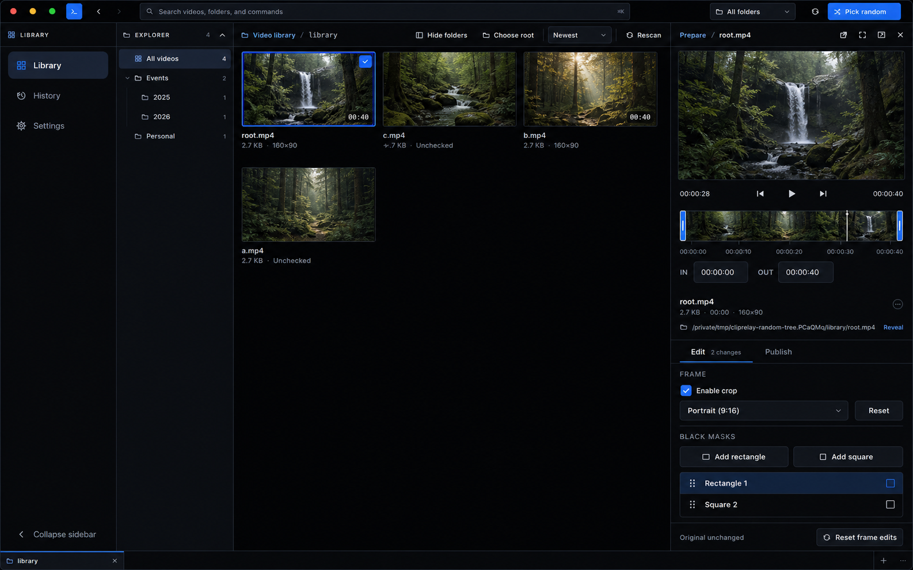
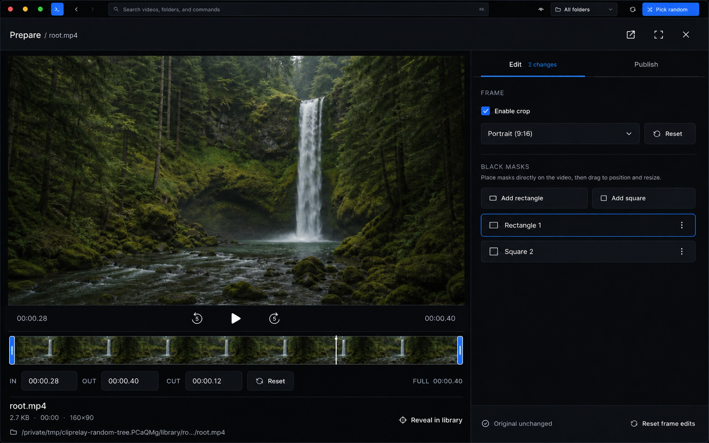
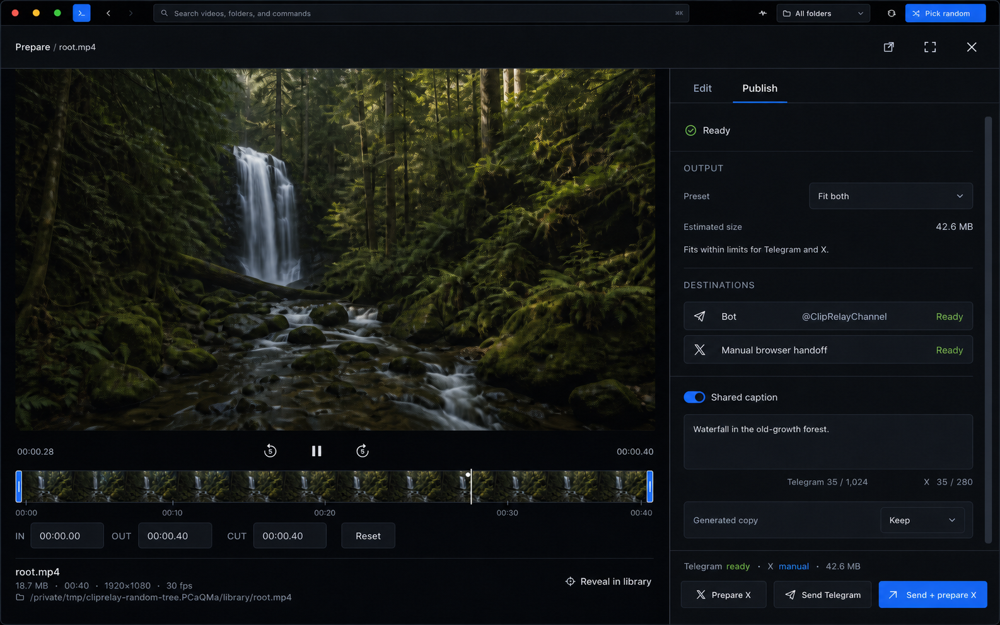

# Prepare Inspector Redesign

## Implementation Status

Implemented in the production QML workspace. Docked, widened, and full-screen
Prepare now share one persistent media stage, inspector, and action dock. The
full-screen context bar was tightened to 38 logical pixels after visual review,
preserving the title and essential window actions without giving up editor
height.

## Direction

The Prepare redesign follows one rule: **one media stage, one inspector, one
action dock**.

The selected video remains visible while the user trims, edits, configures an
output, writes captions, or starts delivery. Docked, widened, and full-screen
Prepare use the same live controls and state. Only their arrangement changes.

The visual direction extends the approved upper workbench and Library canvas:
a compact desktop inspector with VS Code-like structure, native interaction,
flat tonal layers, and restrained use of the active theme accent. Pitch Black
is the primary visual reference; Relay and Full White receive exact parity.

## Reference Mockups

These mockups were generated from fresh Pitch Black screenshots of the current
live build. They preserve the existing ClipRelay shell and change the Prepare
workspace described by this plan.

### Docked Edit



### Full-screen Edit



### Full-screen Publish



The mockups establish hierarchy, density, and responsive composition. The
written interaction, accessibility, performance, and state requirements remain
authoritative where a static image cannot express behavior.

## Product Decisions

This plan locks the following decisions for the production-ready first pass:

1. Prepare has two tool tabs: **Edit** and **Publish**.
2. Trim and playback remain part of the persistent media stage because both
   editing and publishing depend on them.
3. Output compression stays at the top of Publish. A separate Output tab would
   add navigation without creating a distinct workflow.
4. Publish actions and active progress live in a pinned action dock. They never
   disappear at the bottom of a long inspector scroll.
5. Docked and full-screen Prepare share one live component tree. Switching
   mode must not recreate the player, reset state, or flash the video.
6. The original video remains read-only. The interface states this once,
   clearly, instead of repeating large explanatory blocks.
7. Black masks use a compact object list rather than a dropdown. The user can
   see, select, and remove every mask without opening another layer.

## Problems in the Current Inspector

The current Prepare panel is functional, but its structure no longer matches
the rest of ClipRelay:

- Docked Prepare is one long scroll containing the stage, metadata, edits,
  output, Telegram, captions, cleanup, progress, and results.
- Primary delivery actions can be far below the current viewport.
- Full-screen Prepare introduces a second composition and a separate 70-pixel
  header, so the two modes feel related rather than identical.
- Switching display modes resets tool scroll positions and may rebuild parts
  of the visual tree.
- Output configuration, destination readiness, captions, and delivery results
  do not have a clear hierarchy.
- Repeated headings, safe-copy pills, and explanatory paragraphs consume more
  vertical space than the controls they explain.
- Masks are hidden behind a combo box once created, which makes a simple
  object stack feel opaque.
- The selected source is visible, but its filename, path, metadata, and Reveal
  action are not composed as one concise source identity.

## Scope

This redesign covers:

- docked, widened, and full-screen Prepare layouts
- the Prepare segment of the Library context toolbar
- video stage sizing and responsive behavior
- transport, filmstrip, trim handles, and exact time fields
- source filename, metadata, path, and Reveal behavior
- Edit and Publish inspector tabs
- crop and black-mask controls
- compression, Telegram, captions, cleanup, and readiness states
- pinned actions, progress, cancellation, partial success, and X handoff
- draft persistence across workspaces and display modes
- keyboard navigation, accessibility, theming, and performance
- decomposition of the current monolithic QML component

This pass does not add:

- new edit types, filters, transitions, audio mixing, or multi-clip timelines
- automatic posting to X
- new Telegram account or delivery protocols
- changes to media scanning, thumbnail generation, or Library paging
- a History, Settings, activity rail, or workspace-tab redesign
- a new release workflow

## Core Anatomy

Prepare uses seven vertical regions in docked mode:

1. Existing 42-pixel Library context toolbar segment.
2. Optional inline validation or error strip.
3. Persistent video stage.
4. Transport and combined seek/trim timeline.
5. Compact source identity strip.
6. Fixed Edit/Publish tab bar above a scrollable inspector viewport.
7. Pinned state and action dock.

The outer panel itself no longer scrolls. Only the active inspector tab
scrolls. The video, timeline, selected source, tab bar, and current action
state remain available.

### Docked layout

```text
┌ Prepare / selected-file              open  wide  full  close ┐
├ optional validation or error strip                           ┤
│                                                              │
│                    uncropped video stage                      │
│                                                              │
│ current time        back  play  forward          duration     │
│ [ filmstrip + playhead + IN/OUT trim handles               ] │
│ IN 00:00.00   OUT 00:23.41       CUT 00:16.94    Reset        │
├ selected-file.mp4                                      reveal ┤
│ /middle/elided/path/to/selected-file.mp4                      │
├ Edit  2 changes                Publish  Ready                 ┤
│                                                              │
│                    active inspector tools                     │
│                         scroll here                           │
│                                                              │
├ exact readiness, progress, warning, or result state          ┤
└ context-sensitive actions                                    ┘
```

### Full-screen layout

```text
┌ Prepare / selected-file                 player  exit  close ┐
├───────────────────────────────────────┬─────────────────────┤
│                                       │ Edit      Publish    │
│                                       ├─────────────────────┤
│        large uncropped video           │                     │
│        and direct frame edits          │ active inspector    │
│                                       │ scroll              │
│                                       │                     │
├ transport and filmstrip timeline ─────┤                     │
│ source identity and exact trim values  ├─────────────────────┤
│                                       │ pinned action dock  │
└───────────────────────────────────────┴─────────────────────┘
```

## Prepare Context Toolbar

The existing Prepare context segment remains the canonical docked header.

- Keep Open in default player, Widen or Narrow, Full-screen, and Close.
- Show `Prepare` at every supported width.
- Show the middle-elided selected filename after `Prepare /` when enough width
  is available.
- Show an edited-state glyph when crop or masks are active; its tooltip names
  the active changes.
- Keep all icon targets at least 44 logical pixels even when their visible
  treatment remains 28 to 30 pixels.
- Long filenames never push the actions outside the segment.

Full-screen mode replaces its current 70-pixel header with a 42-pixel studio
context bar using the same metrics, icon vocabulary, and divider as the upper
workbench. It contains the filename, edit state, Open in player, Exit
full-screen, and Close. It does not repeat large title or description text.

## Persistent Media Stage

The stage remains visually dominant and uses one `MediaPlayer`, one
`VideoOutput`, and one `VideoEditCanvas` in every layout.

- Video always uses `PreserveAspectFit` with a quiet media-well letterbox.
- Playback controls never overlay the frame.
- Autoplay and infinite looping remain unchanged.
- Opening, widening, narrowing, or entering full-screen does not reassign the
  media source or restart playback.
- Crop and mask interaction remains directly on the video.
- An edited frame uses the existing precise accent outline, not a new card or
  persistent banner.
- The stage may shrink within defined limits on short windows, but it never
  collapses into a thumbnail.

### Stage sizing

- **Docked, 360 to 479 pixels:** readable stage with compact transport and a
  52 to 60-pixel filmstrip.
- **Widened, 480 to 680 pixels:** stage width grows, but preview height is
  capped so tool space is not consumed by the aspect ratio alone.
- **Full-screen:** stage fills the left workspace above a fixed timeline
  region. Portrait and unusual sources remain centered and uncropped.
- **Short windows:** preview height yields before timeline precision fields,
  tab access, or the active action dock.

## Transport and Combined Cut Timeline

The current filmstrip timeline remains the right foundation and receives a
precision pass rather than a conceptual replacement.

- Current time sits at the left and total duration at the right.
- Back five seconds, Play or Pause, and Forward five seconds remain centered.
- The filmstrip contains the playhead and both trim handles.
- Content outside the cut remains subdued; the selected cut retains the active
  theme accent outline.
- IN and OUT fields remain directly below the filmstrip and accept exact time.
- Cut duration and Reset cut share the right side of the precision row.
- Timeline loading state moves to a compact status beside the time controls;
  no loading message covers the video or filmstrip.
- Handles keep their enlarged invisible hit areas and keyboard adjustment.
- Dragging, seeking, and typing timecodes update the same central trim state.

Space continues to control playback. Global Left and Right continue selecting
the previous or next library video unless a time field or trim handle owns
focus. Focused trim handles retain their existing fine adjustment behavior.

## Source Identity Strip

The selected file becomes one compact, stable block below the timeline.

- Row one: middle-elided filename, file size, duration, resolution, and Reveal
  in library.
- Row two: middle-elided absolute path with a tooltip exposing the complete
  value.
- Open in default player stays in the context toolbar and is not duplicated.
- Reveal continues to open the containing Explorer branch and focus the tile.
- Checking does not replace the source identity or make the panel jump.

## Inspector Tabs

The fixed tab bar contains **Edit** and **Publish**.

- Tabs use familiar tab semantics, keyboard focus, and accessible selected
  state.
- Active state is a tonal surface and concise accent treatment, not a large
  filled button.
- Edit can show `No edits`, `Crop`, or a count such as `2 changes`.
- Publish can show `Ready`, `Needs setup`, `Working`, or `Result` with text and
  an icon so state never depends on color.
- Switching tabs preserves each tab's scroll position.
- Switching display mode preserves the active tab and both scroll positions.
- Selecting another video resets tool scroll positions but restores that
  workspace's saved draft when one exists.

## Edit Inspector

Edit contains two sections and one quiet safety footer.

### Frame

- `Enable crop` and the crop preset share one compact control group.
- Presets remain Free, Original, Square, Landscape, and Portrait.
- Reset crop appears only when crop differs from the original frame.
- The active crop is summarized in the Edit tab state.
- Selecting crop clears mask selection, matching current direct-manipulation
  behavior.

### Black masks

- Add rectangle and Add square form a compact object toolbar.
- Created masks appear in a bounded object list in draw order.
- Each row shows type and index, for example `Rectangle 1`.
- Clicking a row selects the matching overlay on the video.
- The selected row has Remove; Clear all remains a separate explicit action.
- The list is capped before scrolling so several masks do not consume the
  entire inspector.
- Selection outline and resize handle remain visible on the stage.
- Empty state says `No masks` and keeps Add actions immediately available.

### Edit footer

The footer says `Original unchanged` with a shield or copy glyph. If edits are
active, it also exposes `Reset frame edits`. It does not use a large card or
repeat the same explanation in every section.

## Publish Inspector

Publish follows the order in which delivery decisions are made: output,
destinations, captions, generated-file handling.

### Output

- Compression preset and estimated output size share one header row.
- Presets remain Original when possible, Balanced, Fit Telegram bot, Fit X,
  Fit both, Smallest practical, and Custom size.
- Custom size reveals a single MB field inline without shifting unrelated
  sections.
- A concise detail line reports the expected fit or current warning.
- The estimate updates from trim length and preset without starting export.

### Destinations

Telegram and X use two compact destination rows.

- Telegram row shows Bot or Personal, destination, and exact readiness.
- Bot or Personal remains directly selectable; changing it persists to
  Settings as it does now.
- Missing account setup links the user to the relevant Settings section.
- Missing destination gives a direct inline instruction.
- X row states `Manual browser handoff` and reports the configured duration
  fit or warning.
- Delivery controls preserve current validation and capabilities; the visual
  redesign does not silently introduce new posting restrictions.

### Captions

- A `Shared caption` control replaces the long explanatory checkbox label.
- Shared mode shows one text area with both Telegram and X counters.
- Separate mode shows clearly labeled Telegram and X fields in the same
  scrollable section.
- Counters use stable tabular figures and name the exceeded limit.
- Captions stay intact when switching tabs, modes, or workspaces.

### Generated file

Generated-file cleanup becomes a compact advanced row near the end of
Publish: Keep, Trash when complete, or Trash after Telegram.

- The label explicitly says `Generated copy`; it can never imply the original.
- Cleanup changes continue to persist to Settings.
- Source files remain structurally ineligible for cleanup.

## Pinned State and Action Dock

The bottom dock is the inspector's stable completion point.

### Edit state

When Edit is active, the dock remains minimal: original-safe state and Reset
frame edits when applicable. It does not reserve a large empty action area.

### Publish state

When Publish is active, the dock contains:

1. One concise readiness line: Telegram state, X manual state, and estimated
   output size.
2. `Prepare X` and `Send Telegram` as independent secondary actions.
3. `Send + prepare X` as the primary action.

At narrow dock widths, the two independent actions share one row and the
combined action occupies the row below. At wider inspector widths, all actions
may use one row if their labels remain complete.

### Active operation

Once work starts, the dock replaces action buttons with:

- exact stage text
- bounded progress and percentage
- destination-aware status
- Cancel

The dock does not scroll away. Navigation, Close, and safe recovery behavior
remain available according to current controller rules.

### Completion and partial success

The result state remains pinned until dismissed or the selection changes.

- Telegram success or failure is named explicitly.
- X handoff readiness is named separately.
- Copy video, Drag video, and Show in folder remain immediately available.
- Partial success never collapses into a generic failure.
- Retry routes remain destination-specific.

## Validation and Error States

Prepare uses a slim inline status strip between the context toolbar and stage.

- **Checking:** `Checking selected video` with bounded activity feedback.
- **Ready:** strip disappears without moving the fixed inspector regions more
  than its own height.
- **Unavailable or invalid:** exact reason with Retry, Reveal, or Choose another
  video as appropriate.
- **Timeline building:** compact timeline-local state, never an overlay on the
  video.
- **Telegram incomplete:** Publish stays usable for X; Telegram-dependent
  actions explain why they are disabled.
- **Caption or duration warning:** appears beside the affected control and in
  the action-dock summary.
- **Export or send failure:** exact failed stage, retained generated path when
  one exists, and a recovery action.

## Responsive Behavior

The inspector uses structural breakpoints rather than scaling type fluidly.

### Docked compact

- 360 to 479-pixel panel
- one-column tool forms
- icon-first secondary actions with tooltips where necessary
- two-row Publish actions
- source filename and path use middle elision

### Docked wide

- 480 to 680-pixel panel
- selected form rows may pair related controls
- longer labels remain visible
- preview height is capped to preserve inspector space
- existing Widen or Narrow button remains the fast preset

### Full-screen studio

- media stage on the left, inspector on the right
- inspector width defaults between 400 and 520 pixels
- a one-pixel divider has a wider invisible drag target
- inspector may be resized between safe bounds
- double-clicking the divider returns to the recommended width
- the chosen width persists without changing docked width presets

At the minimum app width and every workspace scale preset, Close, timeline
precision, tabs, and the current primary action remain reachable. When a
window is too short to satisfy the full stage, the stage yields space before
tool labels, fields, or action targets are clipped.

## Visual System

- flat tonal regions separated by one-pixel dividers
- no outer inspector card and no nested cards
- 4-pixel technical media frame; 4 to 6-pixel toolbar radii
- 12 to 13-pixel system UI labels; system monospaced type only for timecodes
- uppercase micro-labels only for short section identifiers
- active accent reserved for focus, selection, trim range, and primary action
- semantic success, warning, and error always paired with icon and text
- 28 to 32-pixel visible toolbar controls inside 44-pixel logical targets
- 150 to 180-millisecond color or opacity feedback only
- no layout animation, blur, glow, gradients, or decorative motion

Pitch Black is the reference composition because it exposes contrast and
divider errors most clearly. Relay retains its warm desk tone. Full White uses
the same hierarchy without gray-on-gray controls or abrupt toolbar seams.

## Accessibility and Keyboard Behavior

- Edit and Publish expose tab roles, selected state, and arrow-key traversal.
- Focus order follows stage, timeline, source, tabs, active tools, then dock.
- Every icon-only action has an accessible name and tooltip.
- Every control remains reachable without hover.
- Timeline handles retain slider semantics and keyboard increments.
- Text fields consume typing and editing shortcuts before global shortcuts.
- Space controls playback only when a text control does not own focus.
- Global R and previous or next video behavior remain unchanged.
- Escape exits full-screen before it can close the selected video.
- Error, warning, edited, and ready states never rely on color alone.
- Controls remain usable at 200-percent platform scaling.
- Reduced-motion behavior loses no information.

The command center gains non-destructive Prepare commands such as Open full
editor, Focus Edit, Focus Publish, Reset cut, and Reveal selected video. Send
actions are not added as single-keystroke global commands in this pass.

## State and Draft Model

Controls should no longer be the authoritative store for draft values.
`PreparePanel` owns a central state object containing:

- selected media and active inspector tab
- trim start and end
- crop and mask specification
- compression preset and custom target
- Telegram mode and destination
- shared-caption mode and both captions
- generated-file cleanup policy
- per-tab scroll positions
- studio inspector width

Controls bind to this state. `captureDraft()` and `restoreDraft()` keep their
existing public contract so workspace tabs continue to work.

Draft persistence changes from a 900-millisecond polling timer to a debounced
dirty save. State changes schedule one save; inactive unchanged drafts do no
periodic work. Switching workspaces performs an immediate final save.

## Component Architecture

The current 1,200-line `PreparePanel.qml` is split into focused components:

- `PreparePanel.qml`: state, draft, publish payload, and responsive layout
- `PrepareContextHeader.qml`: full-screen context bar
- `PrepareStage.qml`: single live editor, transport, timeline, and source strip
- `PrepareSourceStrip.qml`: filename, metadata, path, and Reveal
- `PrepareInspector.qml`: tabs, scroll ownership, and action-dock placement
- `PrepareEditInspector.qml`: crop and black-mask tools
- `PreparePublishInspector.qml`: output, destinations, captions, and cleanup
- `PrepareMaskList.qml`: visible mask object stack and selection
- `PrepareActionDock.qml`: readiness, actions, progress, cancel, and results
- `PrepareStatusStrip.qml`: checking, validation, and recoverable errors

`PrepareVideoEditor.qml`, `VideoTimeline.qml`, and `VideoEditCanvas.qml` remain
specialized primitives and are refined in place.

The responsive root uses one grid whose row and column assignment changes by
mode. It does not create parallel docked and studio editors. In particular:

- there is only one `MediaPlayer`
- there is only one video texture and edit canvas
- inspector state survives every layout change
- no layout mode change reassigns the media source
- no mode change resets playback, trim, edit, caption, or scroll state

## Performance Requirements

- Opening or closing Prepare never starts a scan.
- Widening, narrowing, or entering full-screen never requests a new thumbnail,
  filmstrip, preview, metadata check, or database refresh.
- Exactly one preview decoder is active for the selected video.
- Inactive inspector content performs no continuous animation or polling.
- Inspector scrolling performs no filesystem or database work.
- Filmstrip geometry remains stable while its image becomes available.
- Resizing uses direct layout updates without animated width or height.
- Draft saves are debounced and only run after an actual state change.
- Playback stays continuous through responsive layout changes.
- Performance diagnostics show no persistent frame pacing regression at 60 or
  120 Hz during playback, inspector scrolling, or divider resizing.

## Implementation Sequence

The implementation ships as one finished redesign but is built in controlled
stages:

1. **State foundation**
   - centralize draft values
   - replace polling with debounced dirty saves
   - preserve existing publish payloads and workspace restore behavior
2. **Single responsive shell**
   - remove the duplicate studio composition
   - add the shared context header, stage, inspector, and dock regions
   - preserve one live player through every mode
3. **Stage and source refinement**
   - tune responsive video sizing
   - refine transport and timeline hierarchy
   - build the compact source identity strip
4. **Edit inspector**
   - rebuild crop controls
   - replace the mask dropdown with the object list
   - add concise edit state and reset behavior
5. **Publish inspector**
   - rebuild output, destinations, captions, and cleanup hierarchy
   - preserve all three delivery actions
6. **Pinned operation states**
   - move readiness, progress, cancel, result, and X handoff into the dock
   - harden partial success and failure recovery
7. **Responsive and visual polish**
   - add full-screen divider resizing
   - verify all themes, scale presets, long names, and short windows
8. **Regression and packaging**
   - automated state, payload, accessibility, and performance tests
   - local Apple-silicon build and launch verification

## Test Plan

### State preservation

- trim, crop, masks, captions, presets, cleanup, and active tab survive Widen,
  Narrow, full-screen entry, and full-screen exit
- playback position and playing or paused state survive layout changes
- switching workspace saves and restores its independent Prepare draft
- switching inspector tab preserves each scroll position
- selecting another video resets only state that is not part of its draft

### Delivery behavior

- Prepare X, Send Telegram, and Send + prepare X produce unchanged payloads
- Telegram readiness disables only Telegram-dependent actions
- caption limits and destination warnings remain exact
- progress, cancellation, output path, partial success, and retry states remain
  recoverable
- Copy video, Drag video, and Show in folder operate on the generated file only

### Layout and visuals

- screenshot checks at 940, 1200, and 1600-pixel window widths
- docked narrow, docked wide, and full-screen states
- Relay, Pitch Black, and Full White themes
- Standard, Balanced, and Compact workspace scale presets
- portrait, landscape, square, very short, and long-duration videos
- long Unicode filenames, deep paths, and large metadata values
- empty masks, several masks, custom output size, separate captions, active
  progress, failure, partial success, and X-ready result

### Runtime and performance

- only one media player and edit canvas exist
- no scan, model refresh, thumbnail request, or timeline request is caused by a
  Prepare layout change
- no QML binding loops, uninitialized required properties, or anchor conflicts
- opening and closing Prepare does not flash Library thumbnails
- repeated mode changes do not increase active decoders or retained delegates

## Acceptance Criteria

- Prepare is visually one system in docked, widened, and full-screen modes.
- The selected video, timeline, source, tabs, and current action state do not
  disappear inside the inspector scroll.
- The video is never cropped by the UI and controls never cover it.
- Edit and Publish tools have clear, non-duplicated hierarchy.
- Compression remains discoverable without becoming a third tab.
- Every created black mask is visible and directly selectable in the inspector.
- Prepare X, Send Telegram, and Send + prepare X remain separate actions.
- Active progress and Cancel remain visible without scrolling.
- X handoff tools remain visible after completion.
- Originals are never modified or eligible for generated-file cleanup.
- Widen and full-screen transitions preserve playback and every draft value.
- No layout transition causes a video or Library thumbnail flash.
- Long names, paths, status text, and action labels remain contained.
- All three themes and all workspace scale presets are complete.
- Keyboard and screen-reader behavior is complete for every visible action.
- Large-library browsing, playback, and scrolling performance do not regress.
- Automated tests pass and the packaged Apple-silicon build launches.

## Final Recommendation

Build this as an architectural simplification, not a skin over the existing
long scroll. The two-tab inspector and pinned action dock provide the largest
usability improvement, but the single live component tree is what makes the
redesign durable. It removes the current docked-versus-studio divergence,
prevents state loss and media flashes, and gives future Prepare features one
clear place to live without expanding into editor sprawl.
